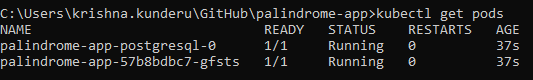
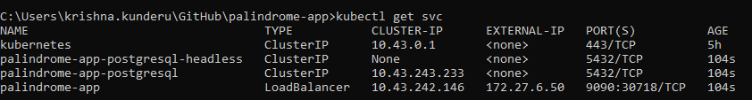

# palindrome-app Project

Backend RESTful services for Palindrome checking and storing in db

## Installation Pre-requisites
* [Gradle](https://gradle.org/install/)
* [JDK 11+](https://www.oracle.com/java/technologies/javase/jdk11-archive-downloads.html)
* [Intellij IDE](https://www.jetbrains.com/idea/download)
* [Docker Desktop](https://docs.docker.com/get-docker/) or [Rancher Desktop](https://docs.rancherdesktop.io/getting-started/installation/)
* Use `docker login` to generate & save auth token to `~/.docker/config.json` (Testcontainers use for integration tests)


This project uses Quarkus, learn more here - https://quarkus.io/ .


This project uses Quarkus, learn more here: 
* [Quarkus](https://quarkus.io/)

## Running the application in dev mode

You can run your application in dev mode that enables live coding using:
```shell script
./gradlew quarkusDev
```

> **_NOTE:_**  Quarkus now ships with a Dev UI, which is available in dev mode only at http://localhost:9000/q/dev/.

> **_NOTE:_**  quarkusDev runs the app on 9000 port with a short-lived Test Container ryuk and on database extension 
> by default is added as postgresql. Once application is stopped, the data would be cleared as the runtime db also gets removed

Visit Swagger Link when app runs on local Profile
* [Local Swagger With App Running on RYUK Test Container](http://localhost:9000/swagger/)

## Packaging and Running the application in local with postgresql database

You can run your application by packaging and run with local postgresql connection

> **_NOTE:_** To run persistent store of reactive Postgresql. Run the below command to run the postgresql on docker

Following 3 commands need to run the app locally

1. Run postgresql on local Docker
2. Run build to package quarkus-run.jar
3. Run quarkus-run.jar
   
It produces the `quarkus-run.jar` file in the `build/quarkus-app/` directory.

The application is now runnable using `java -jar build/quarkus-app/quarkus-run.jar`.

The Tests are run as part of the build and the coverage report can be seen at `build/reports/jacoco/test/html/index.html` 


```shell script
docker run -d --rm --name my_reactive_db -e POSTGRES_USER=postgres -e POSTGRES_PASSWORD=postgres -e POSTGRES_DB=my_db -p 5432:5432 postgres:10.5

./gradlew -Dquarkus.profile=local build

java -jar build/quarkus-app/quarkus-run.jar
```
Visit Swagger Link when app runs on local Profile
* [Local Swagger With Postgresql DB](http://localhost:9090/swagger/)


> **_NOTE:_** To change any application properties, can change the same in application.yaml. 
> Environment profiles can be customized by declaring environment sections in yaml as %local:


## Optional Pre-requisites to deploy using helm charts

* Install components via chocolately
    ```powershell
    # Install Chocolatey
    Set-ExecutionPolicy Bypass -Scope Process -Force; [System.Net.ServicePointManager]::SecurityProtocol = [System.Net.ServicePointManager]::SecurityProtocol -bor 3072; iex ((New-Object System.Net.WebClient).DownloadString('https://community.chocolatey.org/install.ps1'))

    # Install apps
    choco install -y kubernetes-helm
    choco install -y rancher-desktop
    ```

* Configure Rancher Desktop (to replace Docker Desktop)
    * Start Rancher Desktop
    * 
    * 

Run following build and deploy commands using gradle and helm charts. This deploys to local Rancher/Docker desktops on Kubdernetes

* Build and Deploy to Kubernetes
  ```cmd
   # Gradle Build - This builds the docker image `cme/palindrome-app:1.0` of palindrome-app.
   gradlew clean build dockerBuildImage
  # Deploy to local kubernetes using helm charts
    helm upgrade --install palindrome-app helm\palindrome-app
  # Check Pods if running using kubectl command
    kubectl get pods
  # Check svc to see External IP Provided by LoadBalancer
    kubectl get svc
  # The External IP Provided by the LoadBalancer can be used as Service IP and port is 9090. So the Swagger URL 
  for the same is (see below for the link)
  # Also can import the post man collection here in the repo to test the endpoints
  
  ```
  
  
  [Swagger With Kubernetes Deploy Locally](http://172.27.6.50:9090/swagger)
  OR [LocalIP](http://127.0.0.1:9090/swagger) Or [Localhost](http://localhost:9090/swagger)


## Uber packaging

If you want to build an _über-jar_, execute the following command:
```shell script
./gradlew -Dquarkus.profile=local build -Dquarkus.package.type=uber-jar
```

The application, packaged as an _über-jar_, is now runnable using `java -jar build/*-runner.jar`.

## Creating a native executable

You can create a native executable using: 
```shell script
./gradlew -Dquarkus.profile=local build -Dquarkus.package.type=native
```

Or, if you don't have GraalVM installed, you can run the native executable build in a container using: 
```shell script
./gradlew -Dquarkus.profile=local build -Dquarkus.package.type=native -Dquarkus.native.container-build=true
```

You can then execute your native executable with: `./build/palindrome-app-1.0.0-SNAPSHOT-runner`

If you want to learn more about building native executables, please consult https://quarkus.io/guides/gradle-tooling.

## Related Guides

- RESTEasy Reactive ([guide](https://quarkus.io/guides/resteasy-reactive)): A JAX-RS implementation utilizing build time processing and Vert.x. This extension is not compatible with the quarkus-resteasy extension, or any of the extensions that depend on it.

## Provided Code

### RESTEasy Reactive

Easily start your Reactive RESTful Web Services

[Related guide section...](https://quarkus.io/guides/getting-started-reactive#reactive-jax-rs-resources)
